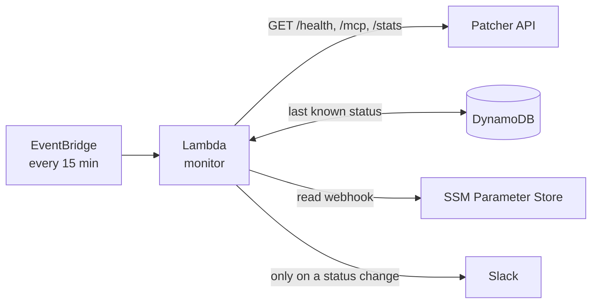

import { Code } from 'astro:components';

{/* Pin to the brainframe commit this post references. Bump intentionally when you
want to refresh the embedded snippets: `cd ~/GitHub/brainframe && git rev-parse main` */}
export const BRAINFRAME_SHA = '0d2ec89c1bb3a9c394d2924d8be7322aa298f100';
export const MONITOR_BASE = `https://raw.githubusercontent.com/liquidz00/brainframe/${BRAINFRAME_SHA}/workspaces/brainframe/monitor`;

export const handlerPy = await fetch(`${MONITOR_BASE}/lambda/handler.py`).then((r) => r.text());
export const mainTf = await fetch(`${MONITOR_BASE}/main.tf`).then((r) => r.text());
export const variablesTf = await fetch(`${MONITOR_BASE}/variables.tf`).then((r) => r.text());
export const localsTf = await fetch(`${MONITOR_BASE}/locals.tf`).then((r) => r.text());

{/* Walk braces from a `resource`/`data` header to the matching close, so we can
embed just the relevant block instead of the whole .tf file. */}
export const extractBlock = (source, header) => {
  const start = source.indexOf(header);
  if (start < 0) return source;
  let depth = 0;
  let opened = false;
  for (let i = start; i < source.length; i++) {
    if (source[i] === '{') { depth++; opened = true; }
    else if (source[i] === '}') {
      depth--;
      if (opened && depth === 0) return source.slice(start, i + 1);
    }
  }
  return source.slice(start);
};

export const lambdaResource = extractBlock(mainTf, 'resource "aws_lambda_function" "monitor"');
export const iamPolicy = extractBlock(mainTf, 'data "aws_iam_policy_document" "lambda"');
export const scheduleResource = extractBlock(mainTf, 'resource "aws_cloudwatch_event_rule" "schedule"');

:::tip[TL;DR]
I built a serverless uptime monitor to check my API is running and data is fresh, and posts to Slack when something changes. You could do the same job with a launchd timer and 40 lines of Python, but I used AWS to learn AWS. **The honest verdict up front is that for a single hobby service, the simple version is enough**.
:::

For years I had no real reason to touch AWS. And the little I'd seen of it looked so vast that I just assumed it would be expensive and complicated on top of that.

Opening the console invites a wall of services onto your screen, each with its own acronym and subsections. That alone was enough sensory overload to make me file the whole platform under "costly and complicated" and move on. So I stayed in the world I knew and told myself I'd climb that curve eventually.

**That assumption turned out to be almost entirely wrong**. 

I only found out by using the [Edge Methodology](https://liquidzoo.io/blog/edge-methodology/) and diving deep into the unknown. At the time, I was concurrently working on [Patcher's API](https://docs.patcherctl.dev/en/latest/guides/usage/api.html) and needed a dead-man's-switch. It's small enough to be safe and real enough to be useful, seemingly the perfect candidate for this exercise. 

:::note[The simpler version]
Throughout this post I'll keep a running note (like this one) pointing out alternate ways to do whatever I just did in AWS. I'm not going to pretend the managed path is the only path. The judgment about when to reach for it *is* the article.
:::

## The verdict, before the build

A dead-man's-switch is straightforward conceptually, basically just send an alert if a scheduled check-in fails. You can build the smallest honest version with a `launchd` service, `curl`, and a Slack webhook in an afternoon. 

:::quote
A watchman who sleeps in the building they are guarding isn't a watchman at all.
:::

So why does mine run on a small pile of AWS services? Genuinely, I wanted to kill two birds with one stone and dive into learning AWS head-first. The switch **has to run somewhere else**, otherwise we'd just get silence if the box goes down (the exact event I most need to hear about). 

The architecture below is engineering for the *off-site* requirement and a deliberate learning detour for the *AWS specifically* part. 

<figure>



<figcaption>EventBridge wakes the Lambda on a timer. It probes the API, compares each result against the last-known status in DynamoDB, and messages Slack only when something actually changes.</figcaption>
</figure>

## What "down" actually means

Before writing any code, we need to define what *broken* means in our context. 

The first obvious answer is a crashed server. Fairly straightforward, we have a `/health` endpoint to poll and can alert on any response that isn't a healthy `200`. But what else? 

Well, for a catalog API that serves application metadata, I'd want to be alerted if that data ever stopped refreshing. Serving stale data is better than serving *no data*, sure, but not by much. If the daily refresh of the catalog fails, the API keeps returning `200 OK` for weeks while the data rots. A plain uptime check would never notice.

### Different kinds of "alive"

- **Liveness:** does the endpoint answer, with the right status code and (optionally) an expected string in the body?
- **Freshness:** is the data recent? The API exposes a `/stats` endpoint with a `last_refresh` timestamp. If that timestamp is older than the refresh interval plus some headroom, the catalog is stale, even though the server is responsive.

:::quote
That second check is the one that earns the whole project. It's the difference between "is the light on?" and "is anyone actually home?"
:::

:::note[The simpler version]
This is still just two HTTP GETs and a timestamp comparison. `curl` plus `date` plus a couple of `if` statements gets you here. Nothing so far requires a cloud.
:::

## Getting into AWS (and proving the bill won't bite)

Signing up is the ordinary part: an email, a credit card for identity verification, a phone confirmation. The part worth saying out loud, because it's what put the cost assumption to bed:

**Almost everything in this project lives inside the AWS Free Tier by a wide margin.** The monitor runs 96 times a day. The Free Tier covers a million Lambda invocations a month. The database is billed per request and stores a handful of tiny rows. There's one stored secret. Add it up and the expected monthly cost is, genuinely, **$0**.

If the cost question is what's kept you away too, do two things on day one:

1. **Set a billing alarm.** AWS Budgets will email you the instant projected spend crosses a threshold you set (mine is a couple of dollars). It's free, and it converts "what if I get a surprise bill" into "I'll get a warning long before any bill is a surprise."
2. **Don't use your root account for daily work.** Which brings us to the part I want to make sure to do properly.

### IAM, the part worth doing right

:::definition[IAM]
AWS's permission system, short for Identity and Access Management. It's where you spell out "this thing may do exactly these actions, and nothing else."
:::

When you sign up, AWS hands you a "root" identity that can do anything, including close the account and run up the bill. You don't use it for everyday work, instead you create scoped identities. 

Two IAM ideas worth internalizing:

- **An IAM role** is a set of permissions that a *thing* (a person, or in our case a Lambda function) can temporarily assume. *The role isn't a login*, it's a costume with exactly the powers needed for one job.
- **Least privilege** means that costume grants the *minimum* set of actions and nothing more.

Here's the actual policy my Lambda runs under. The label on each block denotes what it is allowed to do: write its own logs, read and write one database table, read one secret, decrypt that one secret. That's the entire list.

<figure>
  <Code code={iamPolicy} lang="hcl" />
  <figcaption>monitor/main.tf — the Lambda's least-privilege IAM policy</figcaption>
</figure>

If this function were ever compromised, the fallout is scoped only to reading the uptime table and single Slack URL. It cannot touch anything else in the account, because it was never granted the power to. Least privilege access, executed to a *T*.

## What a Lambda actually is

A Lambda function is a chunk of code that AWS runs *for you, on demand,* with no server for you to provision, patch, or keep alive. You hand AWS a zip of code and say "run the `handler` function when X happens." X can be an HTTP request, a file landing in storage, a message on a queue, or, in our case, a timer.

You pay only for the milliseconds it runs. When it's idle, which is almost always, it costs nothing. That billing model is exactly why a once-every-15-minutes monitor is effectively free.

Other times to reach for Lambda, beyond this could include:

- **Scheduled chores:** nightly cleanups, report generation, this monitor.
- **Reacting to events:** resize an image the moment it's uploaded, process a webhook, fan out a queue message.
- **Glue between services:** a small function that translates one system's output into another system's input.

It's a poor fit when you need something running *continuously*, holding long-lived connections, or doing heavy sustained compute. For short, bursty, event-shaped work, it's ideal.

:::definition[DynamoDB]
A simple, fully-managed database from AWS. In our context its sole job is to remember the last status (up or down) of each watched endpoint, so the monitor only speaks up on a *change*.
:::

Here's the entire monitor. Outside of [`boto3`](https://pypi.org/project/boto3/), it's all `stdlib` Python. The script probes each target, checks freshness, compares against the last-known status in DynamoDB, and messages Slack only when something *changed*.

:::dropdown[Show the full Lambda handler (127 lines)]
<figure>
  <Code code={handlerPy} lang="python" />
</figure>
:::
<figure>
<figcaption>monitor/lambda/handler.py — the whole function</figcaption>
</figure>

The detail I'm proudest of is the transition logic at the bottom. Storing last-known status per target in DynamoDB is what turns a noisy "still down, still down, still down" alarm into a civilized one: it pages me **once** when something goes down, and **once** when it recovers. 

:::quote
An alert that cries every 15 minutes is an alert you learn to ignore, and an alert you ignore is worse than no alert at all.
:::

## Standing it up with Terraform

I could have clicked all of this together in the AWS web console. I didn't, because I wanted the infrastructure to be **reproducible text**, not a series of remembered clicks I'd have to redo (and probably get subtly wrong) if I ever rebuilt it.

Terraform is the tool for that. You describe the infrastructure you *want* in a configuration language (HCL), and Terraform figures out the API calls to make reality match. Change the text, run `terraform apply`, and it computes the diff.

### Lambda

<figure>
  <Code code={lambdaResource} lang="hcl" />
  <figcaption>monitor/main.tf — the Lambda function resource described as code</figcaption>
</figure>

Two lines there do quiet, important work: 
1. `source_code_hash` is a fingerprint of the handler file, so when I change the Python, Terraform notices and redeploys. Leave it out and your code edits silently never ship. 
2. The `environment` block is how configuration (which URLs to probe, the staleness threshold) reaches the function without being hardcoded into it.

:::definition[EventBridge]
AWS's built-in scheduler. Think of it as cron in the cloud: it fires on a timer you set (here, every 15 minutes) and kicks off whatever you point it at.
:::

### Timer

The timer that drives the whole thing is an EventBridge schedule. This is the "check in on a schedule" half of the dead-man's-switch:

<figure>
  <Code code={scheduleResource} lang="hcl" />
  <figcaption>monitor/main.tf — the EventBridge schedule that invokes the Lambda</figcaption>
</figure>

### What it's watching

Configuration of *what* to watch lives in variables, so the next person (or future me) can change targets without ever touching the logic:

<figure>
  <Code code={variablesTf} lang="hcl" />
  <figcaption>monitor/variables.tf — probe targets and the freshness threshold</figcaption>
</figure>

:::note[The simpler version]
Everything above (Lambda, IAM role, DynamoDB table, schedule) is maybe 30 lines of bash and a `launchd` plist if you run it on a box you already own. Terraform earns its keep when the stack has enough moving parts that "rebuild it from memory" becomes a real risk, or when you want the same definition to stand up identically in a second account. For a five-resource monitor it's arguably a wash. I leaned in because reproducible-from-text is a habit I want, not because the size demands it.
:::

## The optional bits

Two components of this specific configuration are completely optional. I've kept this section shorter intentionally to keep the focus of the post on AWS. 

### Slack

You'll need a Slack workspace and a Slack app. Both you can create completely for free.

#### Webhook

The webhook used throughout this article comes from a Slack app. Create one at [api.slack.com/apps](https://api.slack.com/apps), turn on **Incoming Webhooks**, add a webhook to the channel you want alerts in, and copy the URL. That URL is a password (anyone with it can post to your channel), which is why it goes into Parameter Store as an encrypted `SecureString` rather than a plain variable.

#### Keeping the Slack secret out of state
A subtle gotcha with Terraform worth calling out: anything Terraform *creates* gets written into its state file in plaintext, **including secrets**. I didn't want my Slack webhook URL sitting in state. So I created the webhook manually and stored the encrypted value with a single AWS CLI command (below). Terraform only ever references it by its unique ID (its ARN) to grant read access, it never sees the value itself.

<figure>

```bash
aws ssm put-parameter \
  --name /brainframe/monitor/slack_webhook \
  --type SecureString \
  --value 'https://hooks.slack.com/services/XXX/YYY/ZZZ'
```
<figcaption>Use `aws` to store Slack webhook as an encrypted value.</figcaption>
</figure>

<figure>
  <Code code={localsTf} lang="hcl" />
  <figcaption>monitor/locals.tf — referencing the secret's ARN, never its value</figcaption>
</figure>

### HashiCorp Cloud Platform (HCP)

For the truly curious, my Terraform runs remotely on HCP Terraform and authenticates to AWS via OIDC (a keyless trust handshake). This means there are *no* static AWS keys stored anywhere. That's a bootstrapping rabbit hole of its own and deserves its own post. For a first project, running Terraform locally with an AWS SSO profile is completely fine.

## So, was the overkill worth it?

Time for the honest ledger I promised.

### What AWS genuinely bought me

- **Off-site independence.** This is the non-negotiable one. The monitor survives a Linode outage *and* a home-internet outage, because it doesn't depend on either. A cron job on the monitored box could never make that claim.
- **Effectively zero operational burden.** Nothing to patch, nothing to keep running, no server of my own to babysit. It has run untouched and free.
- **Reproducibility.** The entire thing is ~120 lines of HCL and ~120 of Python. I could rebuild it in a fresh account in minutes.

### What it cost

- **Concepts.** To deploy a 40-line script I had to meet IAM roles, policies, EventBridge, DynamoDB, and Parameter Store. That's a real learning tax, even if each piece is small.
- **More surface area.** Five services instead of one box means five things to understand, even if none of them ever needs attention.

### The line where it tips

If you have one hobby service and a spare always-on machine *somewhere other than the thing you're monitoring*, a `launchd` or `cron` timer running `curl` and a Slack post is the right answer. **Genuinely. Don't let anyone (or any AI) talk you into a cloud account for that.**

It tips toward managed infrastructure when **the monitor's independence actually matters**: when "where do I even run this so it survives the outage?" has no good answer among the machines you own, or when you're monitoring something whose failure could take your monitor down with it. At that point, "somewhere else, that costs nothing when idle, defined as code" is not overkill. It's just correct.

For me, the off-site requirement was real, so *some* off-site monitor was always justified. Choosing AWS Lambda specifically, over an equally-valid GitHub Actions cron, was the learning detour. I'd make the same call again, because the thing I was actually buying was experience in a platform I'd written off as too costly and complicated to bother with. That experience turned out to be the cheapest thing on the whole invoice.

The full stack lives in the [brainframe](https://github.com/liquidz00/brainframe) repository under `workspaces/brainframe/monitor/`. If you've been avoiding AWS on the same assumption I was, build something tiny. Set the billing alarm, stay in the free tier, and let a thing that actually works prove the assumption wrong.
