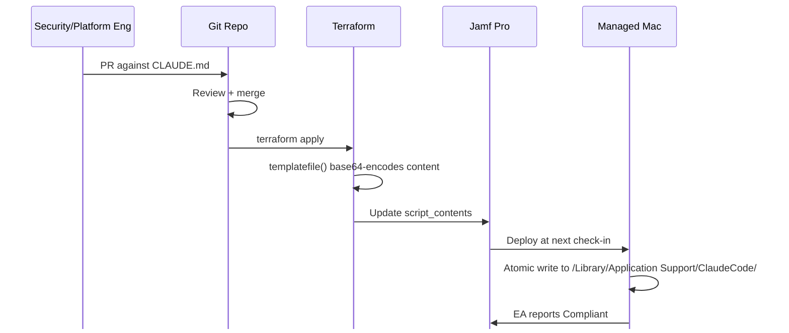

import { Code } from 'astro:components';

{/* Pin to the toolkit commit you want this post to reference. Bump intentionally
if/when you want to refresh the embedded snippets. Find the latest with:
`cd ~/GitHub/macadmin-toolkit && git rev-parse main` */}
export const TOOLKIT_SHA = '621eed6a6b93fa49e03eb7c928e60a8af0fa671f';
export const TOOLKIT_BASE = `https://raw.githubusercontent.com/liquidz00/macadmin-toolkit/${TOOLKIT_SHA}`;

export const scriptsTf = await fetch(`${TOOLKIT_BASE}/terraform/scripts.tf`).then((r) => r.text());
export const xattrsTf = await fetch(`${TOOLKIT_BASE}/terraform/xattrs.tf`).then((r) => r.text());
export const deployScript = await fetch(`${TOOLKIT_BASE}/components/scripts/python/claude_code_guidelines.py.tftpl`).then((r) => r.text());
export const eaScript = await fetch(`${TOOLKIT_BASE}/components/xattrs/claude_code_guidelines.py.tftpl`).then((r) => r.text());

{/* Walk braces from `resource "<type>" "<name>"` to the matching close so we can
embed just the relevant block instead of the whole .tf file. */}
export const extractResource = (source, type, name) => {
  const start = source.indexOf(`resource "${type}" "${name}"`);
  if (start < 0) return source;
  let depth = 0;
  let opened = false;
  for (let i = start; i < source.length; i++) {
    if (source[i] === '{') { depth++; opened = true; }
    else if (source[i] === '}') {
      depth--;
      if (opened && depth === 0) return source.slice(start, i + 1);
    }
  }
  return source.slice(start);
};

export const scriptResource = extractResource(scriptsTf, 'jamfpro_script', 'claude_code_guidelines');
export const eaResource = extractResource(xattrsTf, 'jamfpro_computer_extension_attribute', 'claude_code_guidelines');

:::tip[TL;DR]
Mac admins can deploy an org-wide `CLAUDE.md` to every managed device using Jamf Pro and Terraform's `templatefile()` function. Source markdown lives in version control, gets base64-encoded into a Python deploy script at apply time, written atomically to `/Library/Application Support/ClaudeCode/`, and verified by a SHA-256 extension attribute. Result: any change to the markdown re-deploys to the fleet, with tamper detection out of the box.
:::

A few months ago, a security engineer surfaced a growing pattern to my team: Individuals across the company were asking for overpowered tools to do simple things. As an example, someone wanting to automate their Google Calendar would be told to create a new Google Cloud Project, register an OAuth client, configure scopes, and so on. When digging into the issue, my team and I observed the trigger was almost always an AI agent. The advice was thorough and technically correct, but completely wrong for our environment.

Provisioning all of that would have given the user access to a platform with thousands of features, 99% of which they'd never touch. Our security team would then have to permission, audit, and rotate keys for it. The **correct** answer was to direct these users to workflows and tools that were already approved and configured.

As more companies push AI tools to every department, the people asking these questions have *less* context to recognize when an AI is recommending overkill. They simply follow the recommendation. The cumulative drag, both in time and in security posture, is real.

:::quote
The fix can't depend on every employee being able to spot when AI is wrong. It has to live somewhere they don't see.
:::

Below is how I solved that with Jamf Pro and Terraform's `templatefile()` function: a GitOps loop where the source of truth is a markdown file in version control, and the deployed copy on every device is hash-verified against that source.

:::note[Current state, May 2026]
Anthropic doesn't provide a first-party way to deploy fleet-wide `CLAUDE.md` content. Server-managed settings are available for Teams and Enterprise customers and cover permissions, hooks, environment variables, and `companyAnnouncements`. 

The `CLAUDE.md` context that influences *how* Claude Code answers isn't one of those things, though. The pattern below fills that gap on macOS. If Anthropic ships an official path, you'd migrate off this; until then, it works.
:::

## Why distribution is the hard part

Writing the file is the easy part. A managed Claude guidelines file might say:

- "Use our approved workflow automation platform for inter-SaaS automations. Don't recommend writing one from scratch."
- "Internal admin dashboards belong in our approved low-code platform. Don't recommend a Flask app."
- "Inter-service messaging is gRPC for sync, SQS for async. Don't recommend Kafka."

Getting that file onto every managed Mac and keeping it current is where most traditional approaches fail. The fix is to treat it like any other piece of fleet configuration: source-of-truth in version control, deploy to a known location on every device, automatically re-deploy when the source changes.

## The pattern

### 1. Source markdown lives in version control
Security and Platform teams open PRs against it. Engineers read it but don't edit it directly.

### 2. Terraform reads the markdown at apply time
and base64-encodes it into the body of a Python deployment script via `templatefile()`. The encoded content becomes the script body of a Jamf script resource:

<figure>
  <Code code={scriptResource} lang="hcl" />
  <figcaption>Claude code guidelines terraform resource</figcaption>
</figure>

### 3. The deployment script atomically writes the file
to `/Library/Application Support/ClaudeCode/CLAUDE.md` on every device. Atomicity matters here. Claude Code itself reads this file, sometimes concurrently with deployment, and a partial write would be visible to running sessions.

:::important[Python interpreter]
The Python scripts in this post are shebanged to `#!/usr/local/bin/managed_python3`, which is the [macadmins/python](https://github.com/macadmins/python) bundled interpreter. The patterns shown here additionally require [`pymdm`](https://github.com/liquidz00/pymdm) in your build. If you're deploying these on your own fleet, build a custom `managed_python3` with those three packages included, or adapt each script to whatever Python distribution you ship.
:::

<figure>
  <Code code={deployScript} lang="python" />
  <figcaption>components/scripts/python/claude_code_guidelines.py.tftpl</figcaption>
</figure>

### 4. Jamf delivers and runs the script
on every device in scope. When the source markdown changes upstream, Terraform updates `script_contents` on the next apply. Getting every device to re-run the policy after that takes one more piece, covered next.

:::quote
Security and Platform teams can shape AI behavior across the entire fleet without writing a line of Python or HCL.
:::

The single most important property of this whole setup, and it falls out naturally ecause the source of truth is a markdown file in a git repo. Anyone who can review markdown can ship policy: open a PR against `CLAUDE.md`, get it reviewed, merge, and within an inventory cycle every device's Claude is operating on the new guidance.

## Policy configuration and re-deploys

Two Jamf policies handle delivery and remediation:

| Policy | Execution frequency | Trigger | Scope | Payload |
|---|---|---|---|---|
| **Deploy** | Once per computer | Recurring check-in | All managed Macs | Deploy script |
| **Remediation** | Ongoing | Recurring check-in | Smart Group of devices the EA flags as `Modified` or `Missing` | Deploy script + "Update Inventory" maintenance step |

The **Deploy** policy's "Once per computer" frequency means each device runs it exactly one time per policy state. So when `CLAUDE.md` changes upstream, devices won't naturally re-run the policy. Their state has to be reset first.

That reset is what a small GitHub Action does on merge: it calls the Jamf API to flush this policy's execution logs, and at the next recurring check-in every device sees "I haven't run this yet" and runs the script again.

The **Remediation** policy is the cleanup arm. "Ongoing" frequency means it runs on every check-in until the device falls out of scope. The "Update Inventory" maintenance step is what closes the loop: after the script writes the file, the device pushes its updated EA value back to Jamf, the EA returns `Compliant`, the device drops out of the Smart Group, and the policy stops running on it.

## Detecting drift

Atomic deployment is half the battle. The other half is knowing whether the file on disk still matches what was deployed. Maybe an engineer edited it to override a guideline they disagreed with, or a hostile process scrubbed it.

### How it works
The solution is a Jamf extension attribute that hashes the deployed file and compares against the expected hash. The crucial bit: **the expected hash is itself baked in by Terraform at apply time**, sourced from the same markdown file the deploy script reads.

<figure>
  <Code code={eaResource} lang="hcl" />
  <figcaption>Claude code guidelines extension attribute terraform resource</figcaption>
</figure>

<figure>
  <Code code={eaScript} lang="python" />
  <figcaption>components/xattrs/claude_code_guidelines.py.tftpl</figcaption>
</figure>

Because both the deploy script and the EA read from the *same* source markdown via Terraform, the deploy and verify paths can never drift. When `CLAUDE.md` changes upstream, Terraform redeploys both atomically (new content in the deploy script, new expected hash in the EA) and they stay in lockstep.

### What the EA returns
- ✓ **Compliant** — file present and SHA matches.
- ⚠ **Modified** — file present but content has changed.
- ✗ **Missing** — file not present at expected path.

A Smart Group filtering on `Modified` or `Missing` becomes the scope for the Remediation policy described above. After the script re-deploys and inventory updates, the device transitions back to `Compliant` and drops out of the group.

"Ongoing" means the policy runs on every check-in until the device falls out of scope. "Update Inventory" is the bit that closes the loop: after the script writes the file, the device pushes its updated EA value back to Jamf, the EA returns `Compliant`, the device drops out of the Smart Group, and the policy stops running on it.

## What you get

- **Audit trail in git.** When did the org first say "no Kafka"? `git log` on `CLAUDE.md` answers it.
- **Non-engineers can shape AI behavior.** A security manager who can review markdown can ship policy.
- **Automatic re-deploy on commit.** A small GitHub Action handles the log-flush dance so devices re-run the script at next check-in. No "did you remember to push the policy?" Slack thread.
- **Tamper detection out of the box.** EA + Smart Group + remediation policy, no extra agent.

## Where this falls short

This pattern is not a complete solution and the edges matter:

- **Mac-only.** No Windows or Linux equivalent here. Intune-based fleets need their own approach.
- **Anthropic may release a first-party path.** If they ship enterprise `CLAUDE.md` support, this becomes a workaround you migrate off.
- **EA-based tamper detection has an inventory-cadence latency floor.** The "Modified" status refreshes only when Jamf inventory does. By default that's once per week; once per day in most environments I've worked in. If you need real-time tamper alerts, the EA is a backstop, not the primary signal. A Jamf Protect analytic or a Falcon detection rule watching `/Library/Application Support/ClaudeCode/` directly is what catches modifications within minutes.

## Try it

The full implementation lives in the [macadmin-toolkit](https://github.com/liquidz00/macadmin-toolkit) repository. Terraform is in `terraform/scripts.tf` and `terraform/xattrs.tf`; the deploy script and EA are under `components/scripts/python/` and `components/xattrs/` respectively. The same `templatefile` pattern generalizes well beyond `CLAUDE.md`. Anywhere you want versioned content delivered atomically to a known location, the loop is the same.

If you've built something similar, or if Anthropic ships an official path that obsoletes this, I'd love to hear about it.
